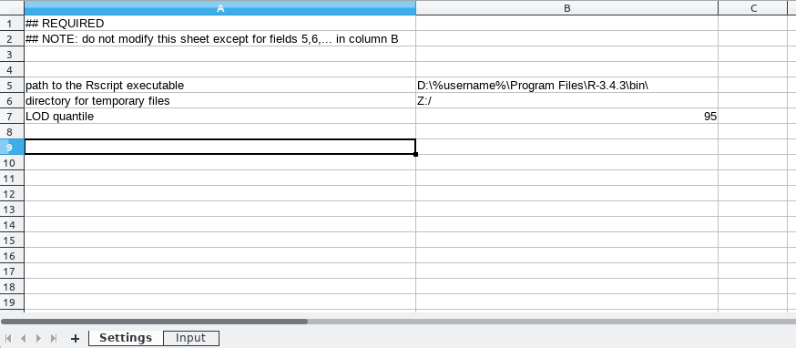
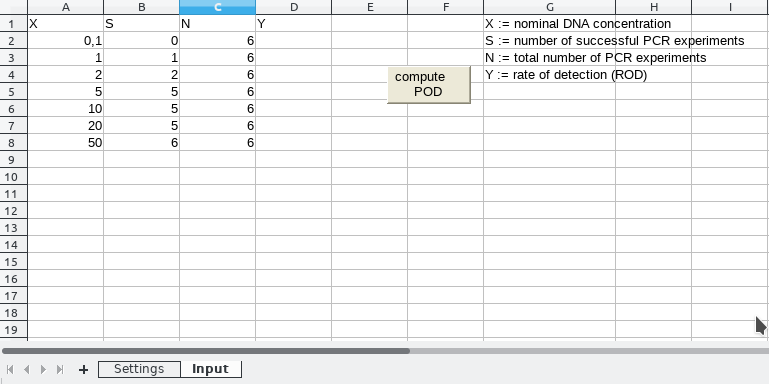

---
title: "POD: How to use the Excel macro"
output: rmarkdown::html_vignette
author: Markus Bönn (State Office for Consumer Protection Saxony-Anhalt)
date: '`r format(Sys.time(), "%d. %B %Y")`'

bibliography: bibliography.bib
vignette: >
  %\VignetteIndexEntry{excelmacro}
  %\VignetteEngine{knitr::rmarkdown}
  \usepackage[utf8]{inputenc}
---


# The POD package: A general introduction
The POD package is a re-implementation of a part of the functionality of the commercial tool "PROLab", provided by _QuoData_ (http://quodata.de/). The current version re-implements the evaluation of qualitative PCR experiments within a single laboratory, as described in [@uhlig2015validation].

<!--
An online tool has been setup to perform this kind of analysis ([http://quodata.de/content/validation-qualitative-pcr-methods-single-laboratory/](http://quodata.de/content/validation-qualitative-pcr-methods-single-laboratory/136-680d729fd3856d5e7c42b9a9ff6cfa48ea709ba7d8deda1a168b3fdba3f63d332f3c17806c8400759e05faa3fd0030107f32a1935e2e2e70e607d697f11aa7df)). The output of this online tool (as of February 2019) was used a s aguideline for the R implementation. It should be noted, however, that some results of the POD package and the original implementation in PROLab might disagree marginally.
-->

An online tool has been setup to perform this kind of analysis ([http://quodata.de/content/validation-qualitative-pcr-methods-single-laboratory/](http://quodata.de/content/validation-qualitative-pcr-methods-single-laboratory/)). The output of this online tool (as of February 2019) was used as a guideline for the R implementation. It should be noted, however, that some results of the POD package and the original implementation in PROLab might disagree marginally.

<!--
Two reasons are to blame for this: First, lack of details about the original implementation in "PROLab". Second, the PROLab implementation might have been subject to significant changes since the last revision of the R package.
-->

For instance, the graph provided by the online tool provides bars for each observation, the R implementation does not.

# The Excel macro
The POD package performs analyses in its natural environment, the statistical programming languange R. However, an Excel macro can be used to access the R package and run basic analyses without R experience.

This tutorial briefly guides you through the macro.

# Analysis
First of all, load the package:
```{r sources}
library(POD)
```

Get the excel macro:
```{r, eval=FALSE}
# where to store a copy of the macro
dest <- "~"
exportExcelMacro(dest)
```
The message confirms the destination, where now you will find a file called "pod.xlsm". Note that a logical is returned, which is FALSE if the a file with name "pod.xlsm" already exists in the destination directory.

## Settings
Open the macro. There are two sheets. In sheet 'Settings' you have to specify essential information about your system and details of your experiment.

1. First, specify the path to your R executable.
2. Define a directory for temporary files.
3. Define the quantile of the limit of detection (LOD). As opposed to the R code, in the Excel macro this has to be an integer. Defaults to 95.



## Input your data
Next, go ahead to sheet 'Input' to enter the data. __Do not change the column headers, the position of the table or the order of columns!__

The columns are as follows

1. nominal DNA concentration
2. number of successful PCR outcomes
3. total number of PCR experiments

Cells contain exemplary values by default. Default values can be used to test the macro. 

Delete default values and enter your own values into columns. Click the button 'compute POD'.



## Diagram sheet
A new sheet appears. The graph shows the observed rate of success for each nominal DNA concentration and a fitted POD curve as well as its $95\%$ confidence interval. In addition, the limit of detection (LOD) at $95\%$ and its $95\%$ confidence interval are provided.

Numerical values of the $LOD_{95}$ and its confidence intervals also appear on sheet 'Input'.

If you choose another LOD quantile, $75$ for instance, the output in the graph and the sheet 'Input' is adapted accordingly.

# Appendix
## Output of `sessionInfo()`
```{r sessionInfo, echo=FALSE}
#sessionInfo(package='POD')
aux <- sessionInfo()
aux$BLAS <- gsub(aux$BLAS, pattern=".*/lib/", replacement = "pathto/lib/")
aux$LAPACK <- gsub(aux$LAPACK, pattern=".*/lib/", replacement = "pathto/lib/")
print(aux)
```

# References
